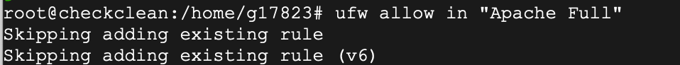
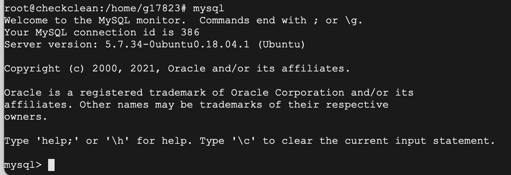
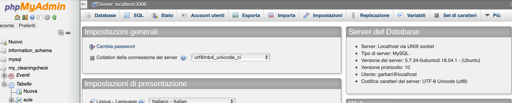
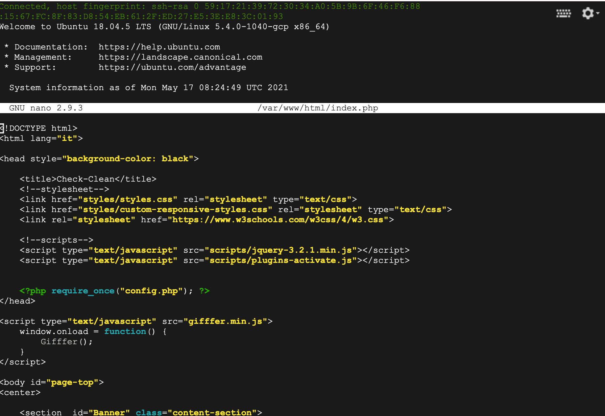

# UBUNTU -LAMP

LAMP è una delle piattaforme software per lo sviluppo di applicazioni web più utilizzate a livello mondiale. L'acronimo deriva dalle iniziali delle quattro componenti software con cui è realizzata: Linux, Apache, MySQL, PHP. Ognuna di queste componenti è predisposta per l'eccellente funzionamento in concomitanza con le altre.Installazione effettuata su macchina virtuale Ubuntu.

# COME INSTALLARE APACHE

Per prima cosa aggiorna i repository della distribuzione, per essere sicuro di scaricare la versione più aggiornata di Apache
 -$ sudo apt update && sudo apt install apache2

Abilitare apache
  -$ sudo ufw allow in "Apache Full"
  
Se la procedura é stata eseguita correttamente verrà mostrata la pagina di benvenuto di Apache.

# COME INSTALLARE MYSQL

Per installarlo digitare la seguente linea di codice
  -$ sudo apt install mysql-server 
  
Per verificare che l'installazione sia andata a buon fine, verifica la versione di MySQL:
  -$ sudo mysqld --version

Questo codice umenterà la sicurezza e limiterà l'accesso ai tuoi database:
  -$ sudo mysql_secure_installation

Per prima cosa ti verrà chiesto se vuoi abilitare il sistema di validazione delle password: se abiliti questo sistema quando imposterai una password per un utente questa sarà valutata e se non rispetterà i criteri minimi di sicurezza verrà rifiutata con un errore.

Per verificare il funzionamento di MySQL prova ad autenticarti :
 -$ sudo mysql 
 Se funziona  entrerai nella scherzata mysql e per uscire digitare:
 - mysql > exit;

INSTALLAZIONE MYSQL CONCLUSA

# COME INSTALLARE PHP

Inizia  con l'installazione dell'interprete PHP
  -$ sudo apt install php libapache2-mod-php php-mysql
 
A questo punto l'installazione sarà stata completata e non dovrai fare altro che verificarlo controllando la versione di PHP installata:
  -$ sudo php -v      se l'instalazzione ha funzionato ritornerà la versione di php
  
Successivamente  modifica il file di configurazione di Apache "dir.conf":
 -$ sudo nano /etc/apache2/mods-enabled/dir.conf
 
 Sposta il file index.php all'inizio della lista, in questo modo:
   <IfModule mod_dir.c>
  DirectoryIndex index.php index.html index.cgi index.pl index.xhtml index.htm
  </IfModule>
  
Salva le modifiche effettuate premendo CTRL + X, digitando Y e infine conferma premendo invio.

Riavvia Apache per applicare le modifiche

  -$ sudo systemctl restart apache2
  
  Per verificare il funzionamento dell'interprete PHP e della configurazione non dovrai fare altro che creare un file index.php nella cartella che contiene il tuo sito:

$ sudo nano /var/www/html/index.php

Inserirci nel file il seguente contenuto che stamperà le informazioni della tua configurazione a schermo:

<?php
phpinfo();
?>
Quindi salva le modifiche effettuate premendo CTRL + X, digitando Y e infine conferma premendo invio.

 
